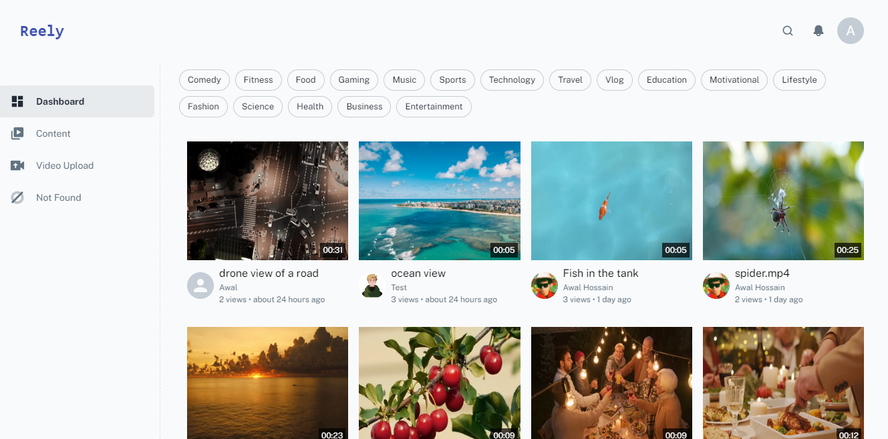

# 🌐 Overview

MERN Video Streaming is a cutting-edge, open-source platform for video streaming, offering a comprehensive, full-stack solution utilizing the latest MERN stack technologies. With MERN Video Streaming, users can easily upload, manage, and stream videos on demand, providing a seamless experience. This project features a video processing capability that provides real-time notifications upon completion.

The backend is comprised of three services, utilizing Redis messaging for communication. These include an API server, a video conversion service, and an HTTP server serving HLS video files. On the client side, the project uses create-react-app and MUI library, along with socket.io-client and React Context.

# 🌟 Features

- Real-time video processing with notifications upon completion
- Three-tier backend services for API, video conversion, and HTTP serving
- Frontend built with create-react-app and MUI library
- Real-time communication with the API server using socket.io-client and React Context

# 🏗️ Architecture

# 📡 Backend Services

### 🖥️ API Server

The API server is an Expressjs app that uses Joi, Multer, BullMQ, Socket.io, and
MongoDB driver. The server communicates with Redis to process and store data,
and uses MongoDB as the primary database. The API server is responsible for the
following:

1. **User Authentication:** Handles user registration, login, and JWT token generation.
2. **Video Upload:** Manages video uploads, stores video metadata in MongoDB, and sends a job to the video processing service.
3. **Video Management:** Provides endpoints for fetching video metadata, deleting videos, and fetching video streams.
4. **Real-time Notifications:** Sends real-time notifications to the client using socket.io upon video processing completion.
5. **Job Queue Management:** Manages the job queue using BullMQ, passing one job to the next upon completion.
6. **Redis Communication:** Communicates with Redis to store job data and send real-time notifications to the client.
7. **Bucket Storage Integration:** Upload completed video file into a CDN bucket storage to store video files, ensuring optimal streaming quality.
8. **Video Streaming:** Serves HLS video files to the client, allowing users to stream videos seamlessly.

The HTTP server communicates with Redis to fetch video metadata and stream video files.
This server is not exposed to the public internet, ensuring a secure video streaming pipeline.

### 🎞️ Video Processing Service

The Video Conversion Service is a Node.js process with ffmpeg responsible for converting videos and managing tasks with the BullMQ library.
First of all, when user upload a video with an watermark image(optional), the API server sends a job to the video processing service. The job contains the video file, the watermark image, and the user ID. The video processing service then processes the video in three steps:

1. **Video Conversion:** Converts any format video into MP4 and applies a watermark if an image is provided.

2. **Adaptive Bitrate Processing:** Transforms the video into adaptive bitrate HLS format (480p & 1080p) for optimal streaming quality.
3. **CDN Upload:** Upon successful conversion, the video is uploaded to a CDN bucket storage. This allows users to stream videos seamlessly from anywhere in the world.

The video processing service communicates with the API server using Redis messaging to send real-time notifications upon completion.

# 📱 Frontend

## 📥 Upload

To upload a video with watermark image, the user must first register and login. After logging in, the user can upload a video with an optional watermark image.
The video is then processed and uploaded to the CDN bucket storage. Upon completion every process, the user receives a real-time notification.

Below some feature of the frontend part of the project:

- **Video Search:** Look for videos by typing in their title.
- **Video Filter:** Pick videos based on specific tags.
- **Video Sorting:** Put videos in order by date, views, likes, etc.
- **Edit Video metadata:** User can edit the video title, description, tag etc.
- **Video Tag:** Add tags to group your videos together.

## 📽️ Streaming

User will able to see their uploaded videos and stream them. The video player is built with HLS.js, allowing for seamless video streaming.
This player has a built-in adaptive bitrate feature, ensuring optimal streaming quality. User can easily switch to different video quality options.
Depend on user internet speed, the video player will automatically switch to the best quality.

On the right side of the video player, user can see the related videos.
Below the video player, user can see the video details.

## 🚀** Upcoming Update **

This project is a work in progress, and there's so much more we can do to enhance it! Here are some of the features we're planning to add in the future. We'd love to hear your thoughts on these:

- **User Profile:** How about a feature where users can view and update their profiles?
- **Video Analytics:** Wouldn't it be great to see analytics like views, likes, and comments for each video?
- **Video Comment:** How important do you think it is for users to be able to comment on videos?
- **Video Like:** Should users be able to like videos?
- **Video Share:** What about sharing videos? How often do you share videos you enjoy?
- **Video Playlist:** How about creating playlists and adding videos to them?
- **Video Subscription:** Should users be able to subscribe to channels and receive notifications for new uploads?
- **Video Notification:** How would you feel about getting notifications when someone likes, comments, or shares your video?
- **Video Embed:** Should users be able to embed videos on their websites?
- **Video Download:** How about a feature for downloading videos?
- **Video Edit:** Should users be able to edit video titles, descriptions, tags, etc.?
- **Video Delete:** How important is it for users to be able to delete their videos?

We're excited about these potential features and would love to hear your feedback. Which of these features are you most interested in? Are there any other features you'd like to see added?

## 🤖 Technologies Used

- **Backend:** TypeScript, Node.js, Express.js,ffmpeg, MongoDB, Redis, BullMQ, Socket.io, AWS S3, ffmpeg, HLS.js
- **Frontend:** React, MUI, HLS.js, socket.io-client, React Context

## 👨🏻‍💻 Github

<a
  href="https://github.com/AwalHossain/video_streaming_service_server"
  target="_blank"
>
  Video Streaming Service Server
</a>

<a href="https://github.com/AwalHossain/video_streaming_client" target="_blank">
  Video Streaming Service Client
</a>

## 📹 Video Explanation

Here is the video explanation of the project where i've explained How the web application works and how the backend services are communicating with each other.Hope this
will help you to understand the project better.

<iframe
  width="80%"
  height="315"
  src="https://www.youtube.com/embed/RCRwublmR9E?si=kN1RwckxAq2zIKEm"
  title="YouTube video player"
  frameborder="0"
  allow="accelerometer; autoplay; clipboard-write; encrypted-media; gyroscope; picture-in-picture; web-share"
  allowfullscreen
></iframe>
